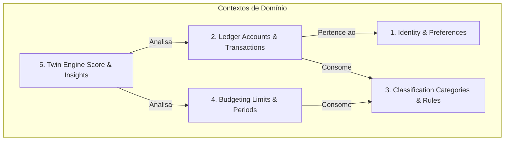
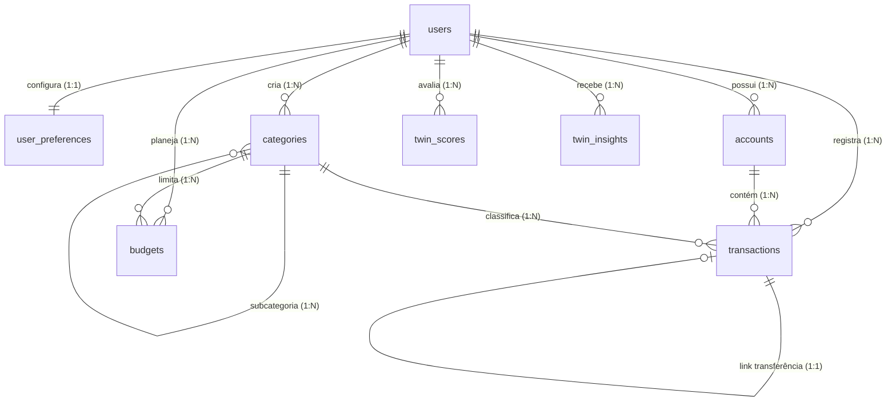

# Finance Twin: Documento de Referência Arquitetural (MVP)

Este documento consolida todas as especificações de produto, design, regras de negócio, modelagem de dados e arquitetura de software aprovadas para o **Finance Twin**. Ele serve como o guia definitivo e especificação de referência para o desenvolvimento da aplicação.

---

## 1. Visão Geral do Produto

O **Finance Twin** é um SaaS de finanças pessoais focado em fornecer clareza comportamental e insights práticos sobre a saúde financeira do usuário. 

A interface afasta-se do visual burocrático e intimidador dos bancos tradicionais. Ela adota a clareza e o minimalismo espacial do **Notion**, a fluidez e a navegação lateral retrátil do **Arc Browser**, e a alta performance operacional (foco em teclado e atalhos rápidos) do **Linear**. 

O conceito central é o **"Twin" (Gêmeo)**: uma projeção matemática baseada em dados reais que espelha as escolhas atuais do usuário contra seu "comportamento saudável ideal", promovendo um feedback positivo e preventivo.

---

## 2. Objetivos do MVP

O MVP do Finance Twin tem como objetivo validar o motor comportamental do app de forma enxuta e focada:
*   **Controle de Fluxo de Caixa**: Registro manual de despesas, receitas e transferências entre contas.
*   **Orçamentos por Categoria**: Planejamento e acompanhamento de limites mensais de gastos.
*   **Twin Health Score**: Pontuação consolidada de 0 a 100 baseada em 6 fatores de comportamento financeiro.
*   **Insights Financeiros**: Alertas e conselhos textuais diretos que orientam o usuário a tomar ações práticas.

> [!IMPORTANT]
> **Fora do Escopo do MVP:** Integrações automáticas de contas (Open Finance), controle de investimentos e gestão de patrimônio líquido bruto não serão implementados nesta versão.

---

## 3. Domínios do Sistema (Bounded Contexts)

Seguindo os princípios do **Domain-Driven Design (DDD)**, o sistema é dividido em 5 contextos delimitados principais:



1.  **Identity & Preferences**: Controla o cadastro de usuários, autenticação e preferências (moeda base, tema visual, fuso horário).
2.  **Ledger (Livro-Razão)**: Controla as contas ativas do usuário e o histórico de transações e transferências.
3.  **Classification (Classificação)**: Gerencia as categorias, subcategorias e regras automatizadas de categorização baseadas em termos de texto.
4.  **Budgeting (Orçamentos)**: Define limites de gastos para categorias em períodos de tempo mensais (`YYYY-MM`).
5.  **Twin Engine (Motor de Saúde)**: Agrega os dados históricos de transações e orçamentos para computar diariamente/mensalmente o Score de Saúde Financeira e disparar Insights comportamentais.

---

## 4. Regras de Negócio Centrais

### 4.1 Movimentações e Saldos (Ledger)
*   **Imutabilidade do Histórico**: Transações nunca devem alterar o saldo de uma conta de forma arbitrária. Toda alteração de saldo exige a gravação correspondente de uma transação.
*   **Atomicidade de Transferências**: Uma transferência entre duas contas deve ser executada como um débito na conta de origem e um crédito na conta de destino sob a mesma transação lógica (de forma atômica no banco de dados).
*   **Restrição de Exclusão de Contas**: Uma conta não pode ser deletada do sistema se possuir qualquer transação associada. O sistema deve sugerir inativação (`status = INACTIVE`) em vez de deleção.

### 4.2 Lógica do Twin Health Score (0-100)
A pontuação de saúde financeira do usuário é calculada a partir de uma média ponderada de 6 fatores comportamentais, sem considerar ativos ou investimentos:

$$\text{Twin Health Score} = (F_1 \times 0.25) + (F_2 \times 0.25) + (F_3 \times 0.15) + (F_4 \times 0.15) + (F_5 \times 0.10) + (F_6 \times 0.10)$$

#### Fatores de Cálculo:
*   **$F_1$: Comprometimento de Renda (Peso 25%)**
    *   *Meta:* Custos fixos devem consumir no máximo 50% da renda.
    *   *Fórmula:* $F_1 = 100 - \max\left(0, \frac{\text{Despesas Fixas}}{\text{Renda Líquida}} \times 100 - 50\right) \times 2$ (mínimo 0).
*   **$F_2$: Capacidade de Poupança (Peso 25%)**
    *   *Meta:* Poupar no mínimo 20% da renda líquida mensal.
    *   *Fórmula:* Se $\text{Taxa Poupança (TP)} \ge 0.20 \implies 100$. Se $TP < 0 \implies 0$. Se entre eles $\implies \frac{TP}{0.20} \times 100$.
*   **$F_3$: Cumprimento de Orçamento (Peso 15%)**
    *   *Meta:* Evitar estouros de orçamentos planejados.
    *   *Fórmula:* Penaliza o score em 20 pontos para cada 100% de desvio somado das categorias que estouraram seus limites.
*   **$F_4$: Estabilidade de Caixa (Peso 15%)**
    *   *Meta:* Manter saldos líquidos equivalentes a no mínimo 3 meses de despesas médias recentes.
    *   *Fórmula:* Se $\text{Cobertura (MC)} \ge 3 \implies 100$. Se $MC < 3 \implies \frac{MC}{3} \times 100$.
*   **$F_5$: Frequência de Gastos Variáveis (Peso 10%)**
    *   *Meta:* Conter a frequência de dias de consumo por impulso (delivery, conveniência) em no máximo 12 dias no mês.
    *   *Fórmula:* Se $\text{Dias de Gasto (DG)} \le 12 \implies 100$. Se $DG > 12 \implies \max(0, 100 - (DG - 12) \times 5)$.
*   **$F_6$: Momentum/Tendência (Peso 10%)**
    *   *Meta:* Premiar a melhoria progressiva do comportamento financeiro.
    *   *Fórmula:* Compara a taxa de poupança atual com a média dos últimos 3 meses. Ganhos acima de +5% garantem nota 100; quedas piores que -5% dão nota 0.

---

## 5. Modelo de Dados Relacional (PostgreSQL)

O banco de dados relacional foi planejado para integridade referencial forte, usando UUIDs como chaves primárias e tipos de dados estritos.



### 5.1 Tabelas e Atributos Principais
*   **`users`**: `id` (UUID, PK), `email` (VARCHAR, UNIQUE), `password_hash` (VARCHAR), `created_at` (TIMESTAMPTZ), `updated_at` (TIMESTAMPTZ).
*   **`user_preferences`**: `user_id` (UUID, PK, FK -> `users.id`), `currency` (VARCHAR(3)), `theme` (VARCHAR(15)), `timezone` (VARCHAR(50)).
*   **`accounts`**: `id` (UUID, PK), `user_id` (UUID, FK -> `users.id`), `name` (VARCHAR), `type` (VARCHAR), `balance` (NUMERIC(19,4)), `currency` (VARCHAR(3)), `status` (VARCHAR), `created_at`, `updated_at`.
*   **`categories`**: `id` (UUID, PK), `user_id` (UUID, FK -> `users.id`, NULLABLE para categorias globais do app), `parent_category_id` (UUID, FK -> `categories.id`), `name` (VARCHAR), `icon` (VARCHAR), `color` (VARCHAR(7)), `type` (VARCHAR), `created_at`, `updated_at`.
*   **`transactions`**: `id` (UUID, PK), `user_id` (UUID, FK -> `users.id`), `account_id` (UUID, FK -> `accounts.id`), `category_id` (UUID, FK -> `categories.id`, NULLABLE), `type` (VARCHAR), `amount` (NUMERIC(19,4)), `description` (VARCHAR), `transaction_date` (TIMESTAMPTZ), `transfer_transaction_id` (UUID, FK -> `transactions.id`), `created_at`, `updated_at`.
*   **`budgets`**: `id` (UUID, PK), `user_id` (UUID, FK -> `users.id`), `category_id` (UUID, FK -> `categories.id`), `amount` (NUMERIC(19,4)), `period` (VARCHAR(7) YYYY-MM), `created_at`, `updated_at`.
    *   *Constraint:* Unique composto `(user_id, category_id, period)`.
*   **`twin_scores`**: `id` (UUID, PK), `user_id` (UUID, FK -> `users.id`), `period` (VARCHAR(7) YYYY-MM), `score_final` (INTEGER), `score_factor_1` (INTEGER), `score_factor_2` (INTEGER), `score_factor_3` (INTEGER), `score_factor_4` (INTEGER), `score_factor_5` (INTEGER), `score_factor_6` (INTEGER), `calculated_at` (TIMESTAMPTZ).
    *   *Constraint:* Unique composto `(user_id, period)`.
*   **`twin_insights`**: `id` (UUID, PK), `user_id` (UUID, FK -> `users.id`), `type` (VARCHAR), `title` (VARCHAR), `description` (TEXT), `status` (VARCHAR), `metadata` (JSONB para cargas dinâmicas como IDs de transações associadas), `created_at`, `updated_at`.

### 5.2 Índices Físicos Recomendados
*   `idx_transactions_user_date` composto em `(user_id, transaction_date)` para acelerar paginação e listagem do extrato.
*   `idx_transactions_account_date` composto em `(account_id, transaction_date)` para conciliação bancária rápida.
*   `idx_budgets_user_period` composto em `(user_id, period)` para validações rápidas de teto mensal.

---

## 6. Fluxos Principais

### 6.1 Ciclo de Vida da Transação e Saldo
```
[Usuário cria transação de Saída]
            │
            ▼
┌──────────────────────────────────────────────┐
│  Service valida e insere em `transactions`   │
└───────────────────┬──────────────────────────┘
                    │
                    ▼
┌──────────────────────────────────────────────┐
│ Service busca a Account e subtrai o amount   │
│ da transação do saldo corrente da conta      │
└───────────────────┬──────────────────────────┘
                    │
                    ▼
┌──────────────────────────────────────────────┐
│      Transação finalizada com sucesso        │
└──────────────────────────────────────────────┘
```

### 6.2 Geração de Insights e Atualização do Score
1.  **Transação Criada / Editada**: Dispara um evento assíncrono.
2.  **Motor de Análise**: Varre a lista de gastos na semana, comparando-a com as metas orçamentárias ativas e o histórico histórico de consumo do usuário.
3.  **Insight Gerado**: Se um desvio (ex: gastos de delivery crescendo) for detectado, um registro em `twin_insights` é inserido com o `status = UNREAD`.
4.  **Recálculo do Score**: A pontuação de saúde é computada novamente e atualizada na tabela `twin_scores` para que o Dashboard reflita a mudança na próxima renderização do usuário.

---

## 7. Arquitetura de Software Proposta

O projeto é estruturado como um **Monólito Modular** baseado em visibilidade de pacotes.

```
src/
└── main/
    └── java/
        └── com/
            └── financetwin/
                ├── FinanceTwinApplication.java
                ├── config/                        # SecurityConfig (JWT), OpenAPI
                ├── shared/                        # Exceções globais, utilitários
                └── modules/                       # Módulos isolados por pacotes
                    ├── auth/                      # Controllers, DTOs de login/signup
                    ├── user/                      # Usuários e preferências
                    ├── account/                   # Contas
                    ├── category/                  # Categorias
                    ├── transaction/               # Transações
                    ├── budget/                    # Orçamentos
                    └── financialhealth/           # Motor do Score e Insights
```

### 7.1 Regras de Encapsulamento
*   **Classes de Entidade (`@Entity`) e Repositório (`@Repository`)** devem ter visibilidade de pacote (*package-private*, sem modificador `public`) sempre que possível. Isso impede que outros pacotes as instanciem diretamente.
*   **Camada `@Service` Pública**: Módulos vizinhos devem se comunicar estritamente chamando os métodos definidos nos serviços públicos dos outros módulos.
*   **Java 21 Records para DTOs**: Pedidos e respostas trafegam exclusivamente via Records, garantindo imutabilidade de ponta a ponta na API.

---

## 8. Roadmap de Implementação

Dividido em 4 fases ordenadas por dependência de dados (Bottom-Up):

*   **Fase 1: Identidade e Segurança (`user` + `auth` + `config`)**
    *   *Entregável:* Cadastro de usuários, autenticação via Spring Security, geração e validação de tokens JWT, controle de preferências básicas.
*   **Fase 2: Estruturação Financeira (`category` + `account`)**
    *   *Entregável:* Cadastro de categorias globais (via migrations Flyway) e customizadas do usuário; criação de contas correntes, poupanças e carteiras de dinheiro.
*   **Fase 3: Fluxo de Caixa (`transaction` + `budget`)**
    *   *Entregável:* Lançamento de despesas, receitas e transferências entre contas (com atualização automática dos saldos), definição de limites de orçamento periódicos.
*   **Fase 4: Análise e Inteligência (`financial-health`)**
    *   *Entregável:* Motor de cálculo do Twin Health Score consolidado pelos 6 pilares, persistência do histórico do score e acionamento de insights inteligentes em formato Callout.
